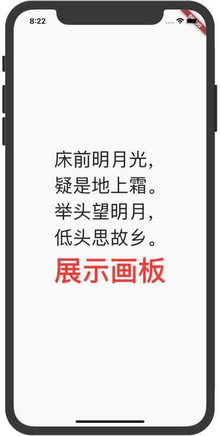
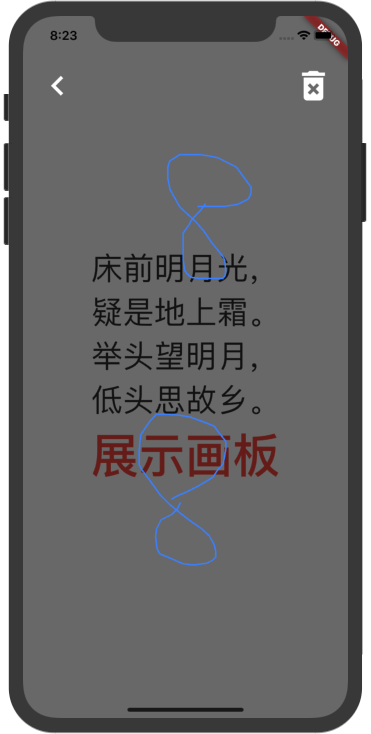
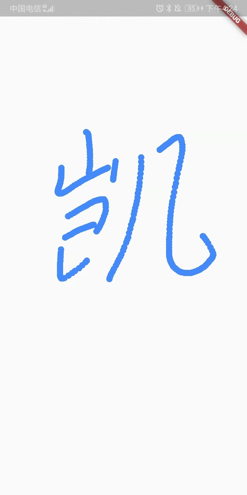

# flutter_canvas_painter
## 一个用canvas+painter+privider实现的半透明草稿纸
写的项目需要实现半透明的草稿纸效果，但没找到合适的，就用canvas+painter+provider自己实现了一个简单的demo
- 
- 
## 一个用canvas+painter+privider实现的半透明草稿纸效果
写的项目需要实现草稿纸效果，但没找到合适的，就用canvas+painter+provider自己实现了一个简单的demo
- 
